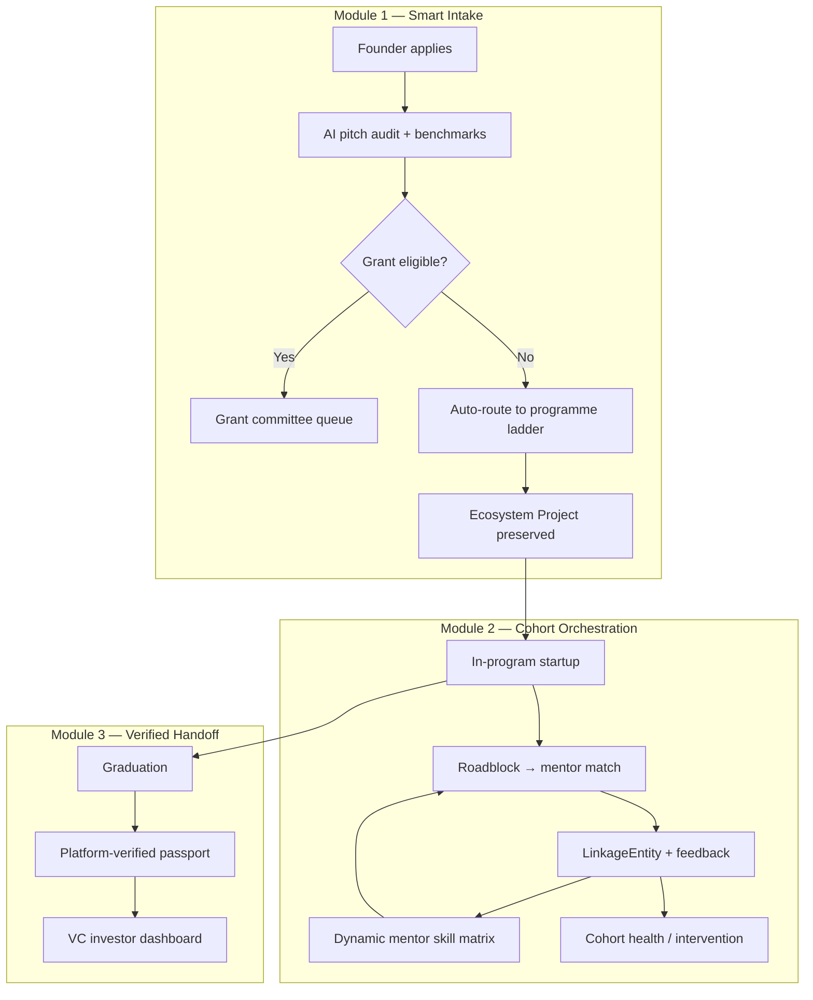

# LinkRouter — National Ecosystem Intelligence OS

**LinkRouter** is a full-stack platform that connects **startups**, **accelerators / grant programmes**, and **venture capital** through a single, reusable data model. Instead of treating each application, cohort, and mentor assignment as a one-off form, the system treats them as **first-class entities** whose history compounds into **ecosystem intelligence**—benchmarks, routing, mentor matching, and investor handoff all read from the same graph.

> **Core idea:** Rejected grant applications are not dead ends. Past cohort outcomes are not lost spreadsheets. Every interaction becomes signal that improves the next intake, match, and VC introduction.

Built for Malaysia’s innovation ecosystem (MYStartup, grant tracks, pre-accelerators, VC readiness), the demo shows how a national accelerator can move from manual coordination to **programmable, self-improving operations**.

---

## The problem: lost ecosystem intelligence

National accelerators and innovation agencies typically run:

| Layer | What happens today | What gets lost |
|--------|-------------------|----------------|
| **Intake** | PDF decks, CSV models, email threads | No shared benchmark vs past winners |
| **Routing** | “Not grant-ready” → rejection email | Founder re-types the same story elsewhere |
| **Cohort** | Mentor assigned by who’s free | Outcomes never update mentor “skills” |
| **VC handoff** | Warm intro over WhatsApp | No verified passport from the platform |

Startups bounce between programmes. Mentors’ real expertise (e.g. B2B enterprise in fintech at Seed) never becomes structured data. VCs redo due diligence from scratch. **Ecosystem intelligence**—the connective tissue between VC, startups, and accelerators—stays in people’s heads and static CRMs.

---

## The solution: three intelligence loops

LinkRouter implements three connected modules. Each module writes durable state onto shared entities so the next actor benefits without re-entry.



### Module 1 — Smart Intake & Auto-Routing

**For:** Founders and programme admins.

- **AI pitch audit** — Pitch text, optional PDF deck, and financial CSV are normalized, scored against historical **benchmark profiles** (sector × stage metrics), and summarized with strengths, risks, and deltas (e.g. “CAC above cohort median”).
- **Programme eligibility** — Hard/soft rules per programme (grant, pre-accelerator, mentor readiness, financial repair, VC readiness).
- **Ecosystem routing** — When grant hard constraints fail, the startup is **auto-routed** to the next rung on the ladder (e.g. Idea stage → MYStartup Pre-Accelerator) with explainable reason codes—**no re-application**.
- **Admin confirm** — Confirmed routing enrolls the `EcosystemProject` as `In_Program` and updates its passport snapshot.

**Intelligence gained:** Every application creates or extends an **`EcosystemProject`** with metrics history and audit artifacts—not a throwaway form row.

### Module 2 — Dynamic Cohort Orchestration *(core innovation)*

**For:** Founders in programme, mentors, and admins.

- **Outcome-based mentors** — `MentorNode` profiles are not static CVs. A **`dynamicSkillMatrix`** is computed from **`HistoricalOutcome`** records (past startups, problem tags, Success/Fail/Pivot, feedback logs).
- **Autonomous matching** — Founders submit a **roadblock**; the engine scores mentors by tag overlap, sector/stage fit, capacity, and historical wins—returning **explainable** match text and a **`LinkageEntity`** (startup ↔ mentor).
- **Cohort health** — Linkages track health score, activity staleness, and `Requires_Intervention` for admin “manage by exception.”

**Intelligence gained:** **`LinkageEntity`** is the relationship graph edge. Its outcomes retrain mentor tags for the *next* batch—closing the feedback loop accelerators rarely capture.

### Module 3 — Verified Handoff *(preview in MVP)*

**For:** VC partners and platform admins.

- On **graduation**, the startup’s digital trail (audits, routing, linkages, KPIs) aggregates into an immutable-style **`passportSnapshot`** on `EcosystemProject`.
- **Investor dashboard** — Read-only portfolio of graduated startups with platform-verified passports, matched to investor mandate concepts (sector, stage, geography).

**Intelligence gained:** VCs receive **warm, pre-validated** leads with context that used to require weeks of DD—because the accelerator already structured the journey.

---

## Who uses the platform

| Persona | Role in the ecosystem | Primary capabilities in LinkRouter |
|---------|----------------------|----------------------------------|
| **Startup / Founder** | Applies for support, executes in cohort | Apply, view audit & routing, roadblock → mentor match, dashboard |
| **Platform Admin** | Runs programmes, escalations | Intake pipeline, routing decisions, cohort health, mentor skill rebuild |
| **Mentor** | Expert delivery, feedback | Linkages, capacity, outcomes that feed skill matrix |
| **VC Partner** | Capital deployment | Graduated portfolio & verified passports (preview API) |

Demo accounts (password `demo123`):

| Role | Email |
|------|--------|
| Founder | `founder@demo.com` |
| Admin | `admin@linkrouter.my` |
| Mentor | `mentor@linkrouter.my` |
| Investor | `investor@linkrouter.my` |

---

## First-class data entities

The database is designed around **reusable programmable objects**, not one-off submissions:

| Entity | Purpose |
|--------|---------|
| **`EcosystemProject`** | Canonical startup record: `Lead` → `In_Program` → `Graduated` / `Dead`, sector, stage, metrics history, **ecosystem passport** JSON |
| **`Application`** | Intake attempt against a `Programme`; links to audits and routing decisions |
| **`Programme` + `ProgrammeRule`** | Grant, Pre-Accelerator, Mentorship, VC Readiness, Sandbox—with hard/soft gates |
| **`IntakeAudit`** | Readiness score, AI summary, benchmark deltas, eligibility snapshot |
| **`RoutingDecision`** | Grant eligible / auto-routed / needs review—with reason codes and admin confirmation |
| **`MentorNode`** | Capacity + **dynamic skill matrix** + outcome summary |
| **`HistoricalOutcome`** | Past cohort evidence used to train mentor tags |
| **`LinkageEntity`** | Active relationship startup ↔ mentor: goal, health, match explanation, feedback logs, final outcome |
| **`RoadblockRequest`** | Founder problem statement triggering match |

The most important edge in the graph is **`LinkageEntity`**: it stores *how* mentorship actually went, which is the raw material for ecosystem intelligence between accelerator operations and future VC confidence.

---

## Programme ladder (ecosystem routing)

When a startup is not grant-ready, routing moves it **down or across** the ladder without losing profile data:

1. **Grant Track** — Full eligibility + readiness threshold  
2. **MYStartup Pre-Accelerator** — Early stage / not incorporated  
3. **Mentor Readiness** — Mid readiness, needs guided support  
4. **Financial Model Repair** — Weak runway, CAC, or margin signals  
5. **VC Readiness** — Growth traction, better fit for investor prep  
6. **Sandbox** — Experimental / regulatory sandbox path  

Routing logic lives in `web/src/server/services/routing/selectBestProgramme.ts`; eligibility rules in `evaluateProgrammeRules.ts`.

---

## Repository structure

```
myhack-md/
├── README.md                 ← This document (product + ecosystem vision)
├── PROJECT_OVERVIEW.md       ← Full PRD (business spec, Russian)
├── MODULE_SCOPE.md             ← MVP module status
├── LOVABLE_FRONTEND_UX_SPEC.md ← UX flows for judges / demo
└── web/                        ← Runnable application
    ├── client/                 # Vite + React UI (apply, dashboards, results)
    ├── src/app/api/            # Next.js API routes
    ├── src/server/services/    # Domain logic (intake, routing, mentor, cohort)
    ├── prisma/                 # SQLite schema, migrations, seeds
    └── public/                 # Production UI build output
```

**Stack:** Next.js 16 (API), Vite + React 19 (UI), Prisma + SQLite, Gemini for pitch audit, Vitest for unit + integration tests.

---

## Quick start

All commands run from `web/`:

```bash
cd web
npm install
npm run db:migrate
npm run db:seed
npm run dev
```

| Service | URL |
|---------|-----|
| API health | http://localhost:3000/api/health |
| UI (dev) | http://localhost:5173 (proxies `/api` to backend) |

Production (single port):

```bash
npm run build
npm start
# → http://localhost:3000
```

Environment: copy `web/.env.example` → `.env` (`DATABASE_URL`, `GEMINI_API_KEY`, `AUTH_SECRET`, `BACKEND_CORS_ORIGIN`).

Tests:

```bash
npm run test
```

See **[web/README.md](web/README.md)** for detailed layout, test file map, and API notes.

---

## Example end-to-end journey

1. **Founder** submits GreenRoute (idea-stage cleantech) → audit compares to benchmarks → grant hard rules fail → **auto-routed** to Pre-Accelerator; `EcosystemProject` stays in ecosystem as `Lead`.
2. **Admin** confirms routing → project **`In_Program`**, passport updated.
3. **Founder** hits a GTM roadblock → `POST /api/founder/roadblock` → matcher picks mentor with highest historical success on relevant **problem tags** → **`LinkageEntity`** created with explanation.
4. **Mentor** completes linkage; feedback feeds future **`buildSkillMatrixFromOutcomes`** runs.
5. **Admin** monitors **cohort health**; stale or low-health linkages surface in intervention queue.
6. **Graduation** → passport snapshot → **Investor** sees verified portfolio entry (Module 3 preview).

Seeded demo data includes 2025 cohort outcomes (Module 2 “past”) and showcase applications (GreenRoute, PayFlow MY) for judge-ready demos.

---

## Design principles

1. **No re-entry** — Routing preserves the ecosystem project; founders are not asked to rebuild their story.
2. **Explainability** — Routing reason codes, audit deltas, and mentor match explanations are first-class API fields.
3. **Relationships over resumes** — Mentor value is proven by linkage outcomes, not self-reported skills.
4. **Manage by exception** — Admins intervene when cohort health degrades, not on every assignment.
5. **VC-ready artifacts** — Graduation produces a structured passport, not a forwarded email chain.

---

## Business outcomes (target KPIs)

From the product vision—the platform aims to:

- **10×** programme throughput via zero-touch intake and routing where rules are clear  
- **Seconds** instead of weeks for startup–mentor matching using historical KPIs by problem type  
- **~80%** reduction in VC due-diligence time on graduates via verified passports  

---

## Further reading

| Document | Contents |
|----------|----------|
| [PROJECT_OVERVIEW.md](PROJECT_OVERVIEW.md) | Full PRD: actors, modules, entities, hackathon scope |
| [MODULE_SCOPE.md](MODULE_SCOPE.md) | Implementation status (Modules 1–2 complete, 3 preview) |
| [LOVABLE_FRONTEND_UX_SPEC.md](LOVABLE_FRONTEND_UX_SPEC.md) | Screen-by-screen UX and demo script |
| [web/README.md](web/README.md) | Developer setup, tests, project layout |

---

## License & context

Hackathon / demo implementation for **ecosystem intelligence** between venture capital, startups, and national accelerator programmes. The name **LinkRouter** reflects routing startups across programme links while **linking** outcomes back into the intelligence graph that benefits mentors, admins, and investors alike.
